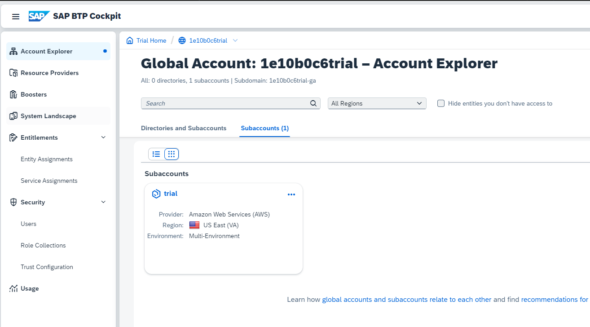
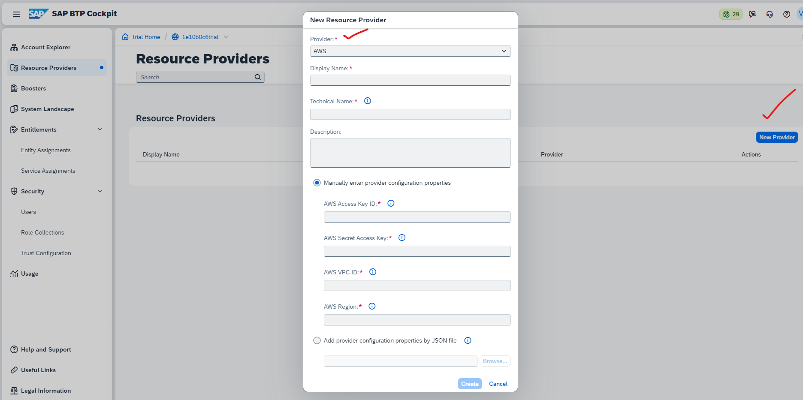
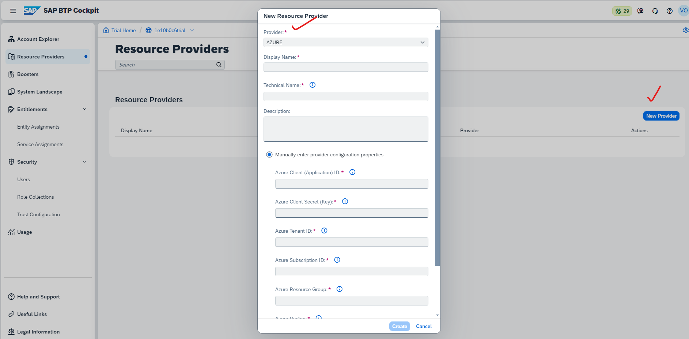
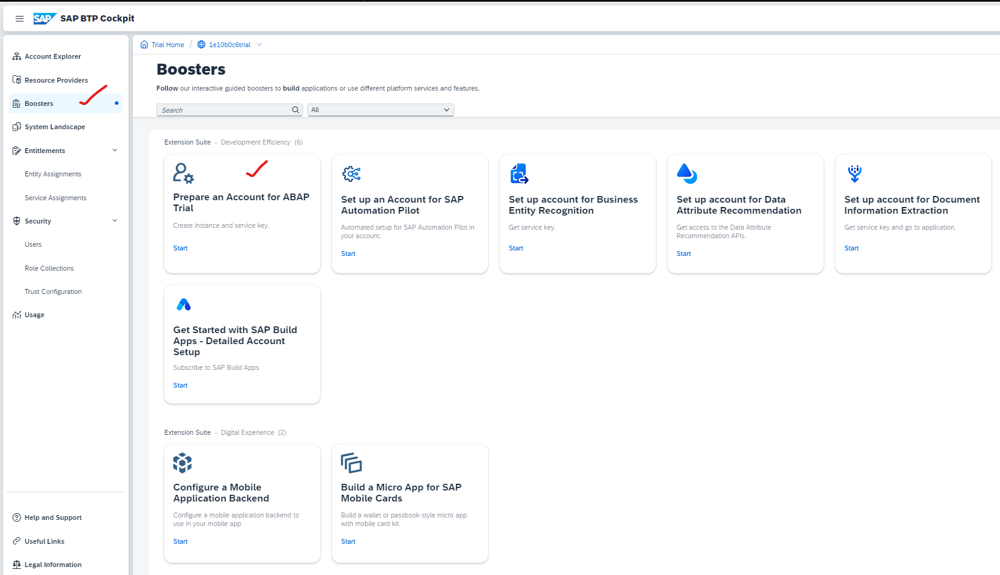
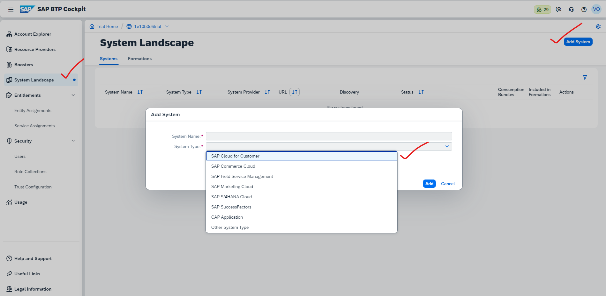
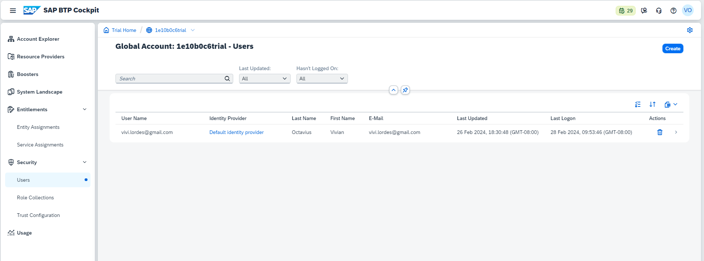
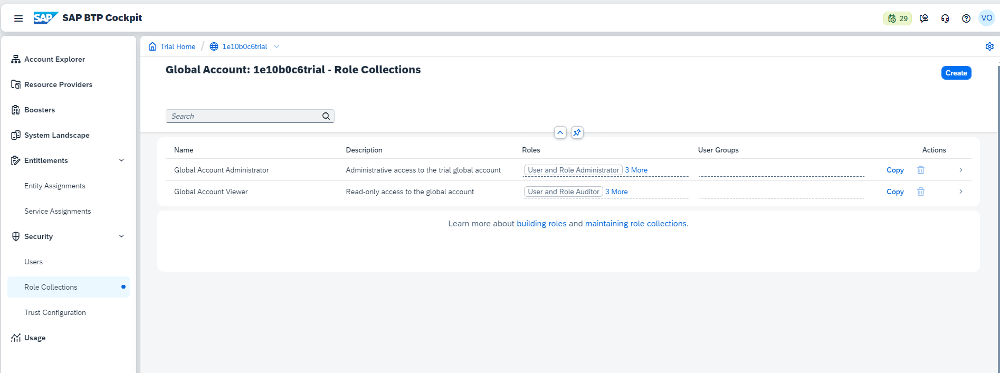
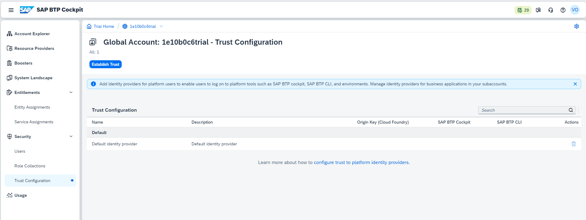
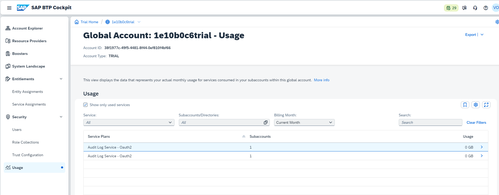

## Global account level in left navigation menu - details & descriptions 

### Account Explorer : 
 
List of sub accounts available for Global accounts listed here 
 
    
 
 
	
### Resource providers : 
 
AWS / AZURE cloud platform services from other providers their technical details to establish connection to leverage their support for BTP
 
 
AWS
 
    
 
 
AZURE
 
    
 
 

### Boosters : 
 
Help you to getto certain predefined template set of activity for quick app development
 
    
 
 

### System landscapes :
 
Connected SAP Systems to the global account (could be on prem or cloud) 
 
    
 
 

### Entitlements : 
 
- Entity assignment (List of services avaialble for sub account can be viewed by selecting sub account based on region)
- Service assignments (List of services available in global account and assignments)
 
Entity Assignments : https://github.com/Octavius-Dante/Nova-Proxima-/issues/1
 
 

### Security : 
 
- Users (list of users active in this global / sub account)
- Role collection (What roles assigned in this global account)
- Trust Configuration (added keys cloud foundry, BTP cockpit and BTP CLI config)
 
 

Users
 

 
Roll collections
 

 
Trust Config
 

 
 

### Usage : 
 
Usauge metrics of the service utillised in BTP account 
 
    
 
 
 
 

## Sub account level in left navigation menu - details & descriptions 
