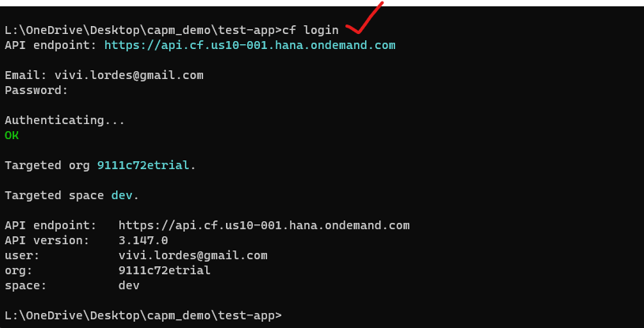
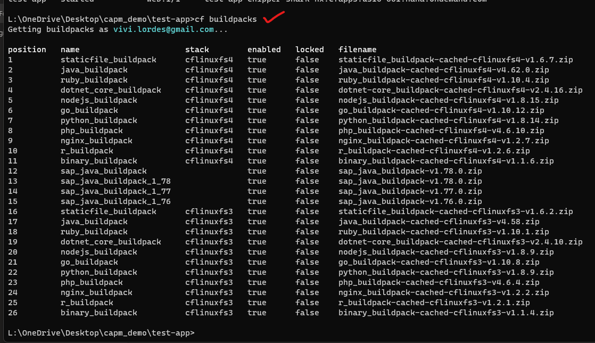
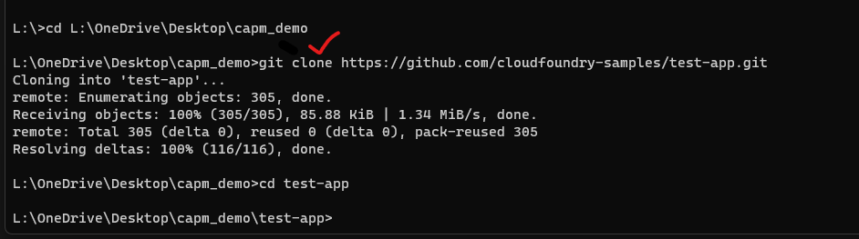
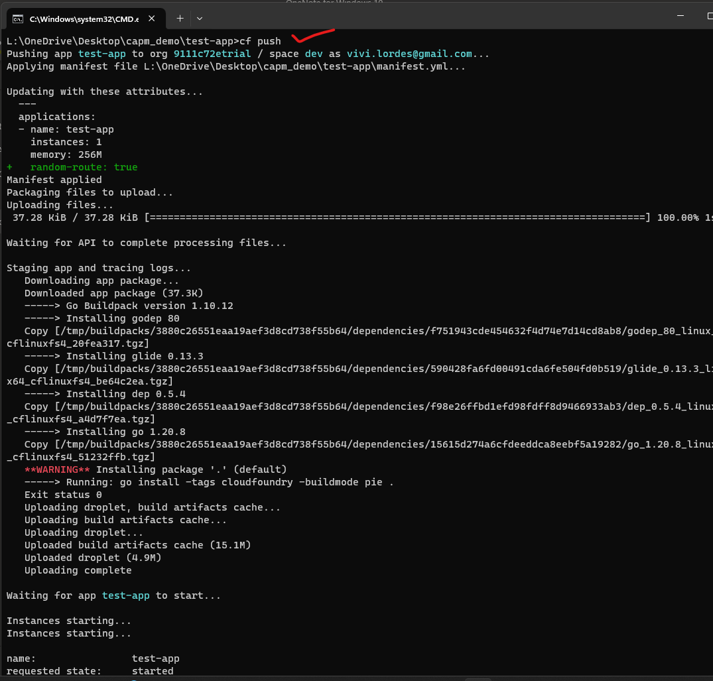
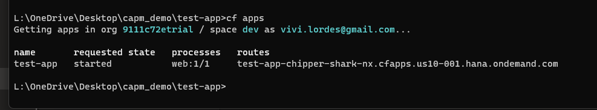
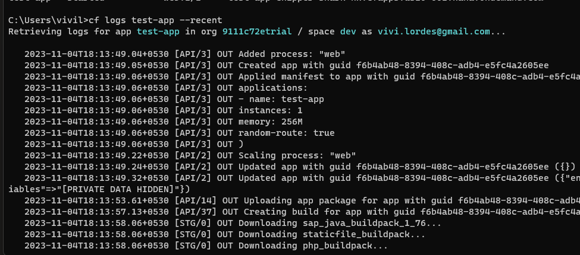

## Cloud application programming model


**Pre-requisities before app deployment**

- [x] App should have manifest.yml file 
- [x] App should have main file 
- [x] then app file respective language *.go , *.js *. etc 

</br>


**Manifest file should have - following components :**

- [x] App name 
- [x] App memeory size 
- [x] Instance number 
- [x] Then URL to be involved in the app execution
> (custom -defined url  or default cloud based url) // recommended -let cloud application to decide the url.

</br>
</br>

## Commands involved in general & app deployment activities : 


1. Logging In
   </br>
   </br>
   
   ```bat
   cf login
   ```
   </br>
   </br>
    
   </br>
   </br>
2. Checking the available buildpacks in the cloud environment
   </br>
   </br>
   
   ```bat
   cf buildpacks
   ```
   </br>
   </br>
    
   </br>
   </br>
3. Cloning Git hub repositiory link to local directory
   </br>
   </br>
   
   ```bat
   gi clone
   ```
   </br>
   </br>
    
   </br>
   </br>
4. Deploying app to cloud
   </br>
   </br>
   
   ```bat
   cf push
   ```
   </br>
   </br>
    
   </br>
   </br>  
5. Checking list of available apps in cloud (deployed)
   </br>
   </br>
   
   ```bat
   cf apps 
   ```
   </br>
   </br>
    
   </br>
   </br>
6. Checking log status for a specific app
   </br>
   </br>
   
   ```bat
   cf logs
   ```
   </br>
   </br>
    
   </br>
   </br>


