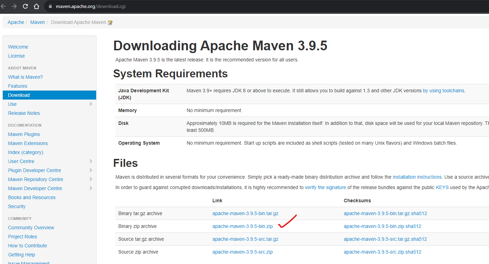
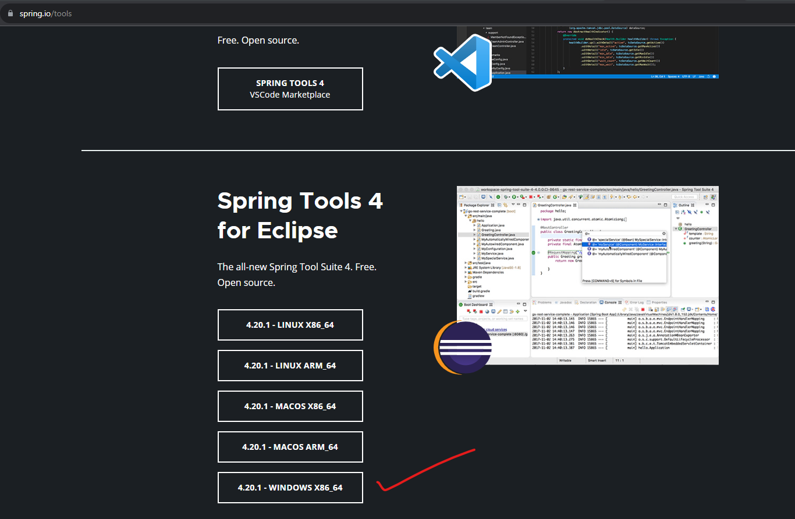
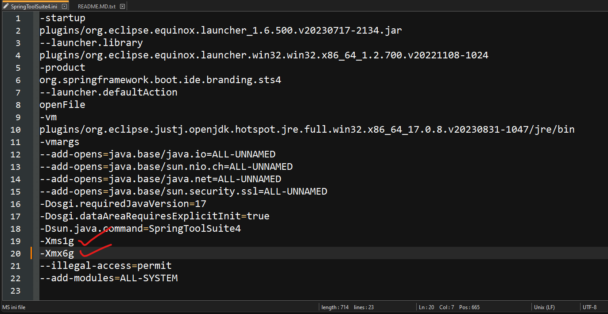
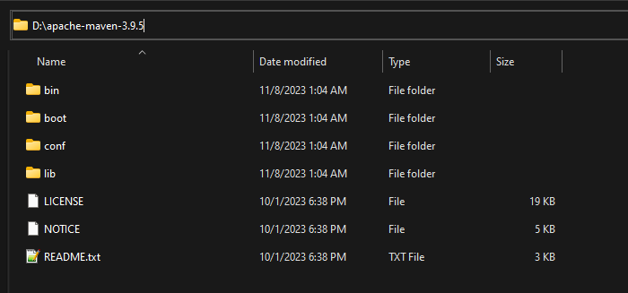
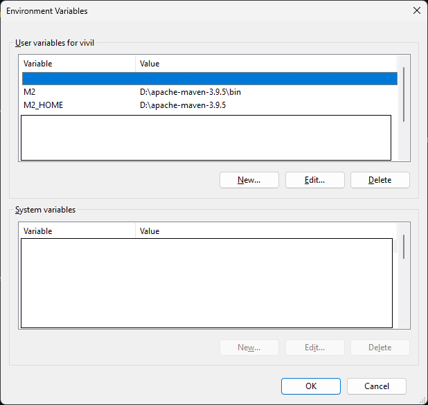
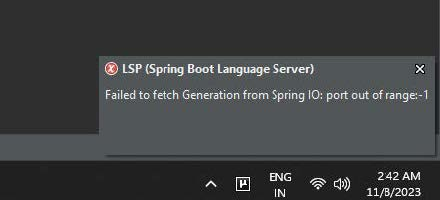
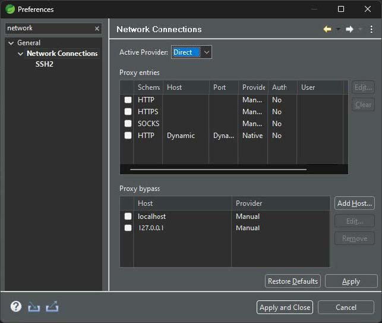

# Maven & Spring Tool Suite - Starter guide

 
 
Maven is essential for managing the project with needed artifcats 
 
 

**Installation of MAVEN to system**

- [X] Prerequisite java installation Legacy sJava 8 (v1.8) is suficient for Maven as on Q4-2023 
- [X] Download the MAVEN file (extract in the needed Directory) https://maven.apache.org/download.cgi

 

**Installation of Spring tools suite to system**

- [X] Prerequisite java installation version 17 or greater needed for Spring tool suite as on Q4-2023 
- [X] Spring Tools Suite (STS) https://spring.io/tools

 

**(1) Maven download**
    
    
    
    
    
   
**(2) Spring Tools suite for windows download - this is a modified verion of eclipse IDE**
    
    
    
    
    
   
**(3) Post Spring STS extraction, increase the RAM allocation fpr STS by making changes to '*.ini file in STS directory**

- Change the values as mentioned in screenshot initiall it will be 512m or 256m , change it to 1G and 6G accordingly MB to GB allocation of RAM for this spring software.

    
    
    
    
    
    
    

**(4) Extract Maven apache server file to a directory and set environmetn varialbes**

    
    
   
    
    
    
    

    
    
   
    
    
    
    

   
# Starting spring tool suite : Troubleshooting issues

 

- [x] **LSP (Spring boot language server) error when you launch Spring STS.**
  
    
   
*Problem :*
    
    
    
    
    
    
      
*Solution : Change the active provider from (Native) to (Direct)*
    
    
    
    
    
